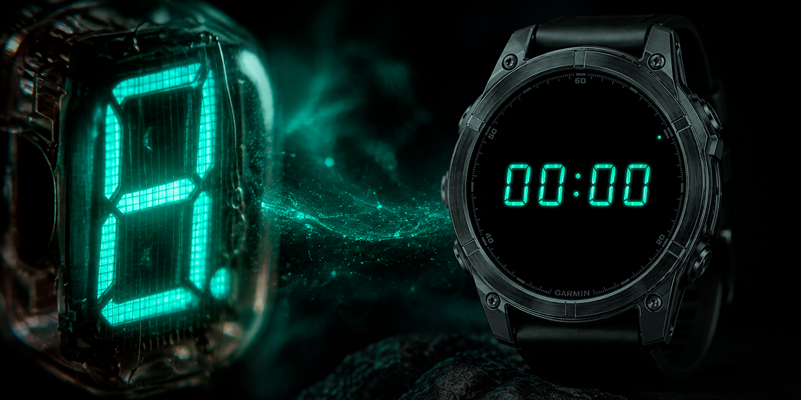

# Garmin Watch Faces

## IV-22

IV-22 is a retro digital watch face inspired by the Soviet-era IV-22 vacuum fluorescent display. Available in three sizes.

### IV-22 Small

A compact, minimalist layout with subtle styling.

[**View in Garmin Connect IQ Store →**](https://apps.garmin.com/en-US/apps/f111e3b0-3d3f-4ebe-b8a2-998dae2a9ff0)

### IV-22 Medium

A balanced layout for everyday readability.

[**View in Garmin Connect IQ Store →**](https://apps.garmin.com/en-US/apps/6685e811-7072-44c2-af2d-832dd471a5f8)

### IV-22 Large

Large digits for maximum readability.

[**View in Garmin Connect IQ Store →**](https://apps.garmin.com/en-US/apps/9a73f5d3-a308-457a-a39b-2a2a6164b367)
